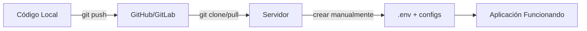

# 🚀 Instrucciones de Despliegue

## � **PARA TRABAJO EN GRUPO/CLASE**

### 1️⃣ Clonar el Proyecto (Compañeros del Grupo)

```bash
# 1. Clonar el repositorio
git clone https://github.com/TU_USUARIO/TU_REPO.git
cd TU_REPO

# 2. Importar la base de datos
mysql -u root -p < sql/database.sql

# 3. ¡Ya está! Los archivos de configuración ya vienen incluidos
# - conexion/db.php ✅ Ya configurado
# - config/whatsapp_config.php ✅ Ya configurado
```

**¡Eso es todo!** Tu grupo puede empezar a trabajar inmediatamente.

### 2️⃣ En el Servidor (Hosting/VPS)

```bash
# 1. Clona el repositorio (primera vez)
git clone https://github.com/TU_USUARIO/TU_REPO.git
cd TU_REPO

# O actualiza si ya existe
git pull origin main

# 2. Crea el archivo .env con credenciales del SERVIDOR
nano .env
# (Copia desde .env.example y llena con datos del servidor)

# 3. Crea los archivos de configuración
cp conexion/db.php.example conexion/db.php
cp config/whatsapp_config.php.example config/whatsapp_config.php

# 4. Edita con las credenciales del SERVIDOR
nano conexion/db.php
nano config/whatsapp_config.php

# 5. Configura permisos
chmod 644 .env
chmod 644 conexion/db.php
chmod 644 config/whatsapp_config.php
chmod 755 storage/
chmod 755 uploads/
```

### 3️⃣ Configuración de Base de Datos

```bash
# Importa la base de datos
mysql -u usuario_servidor -p nombre_base_datos < sql/database.sql
```

## ⚠️ IMPORTANTE: Archivos Sensibles

**NUNCA** están en Git:
- ❌ `.env`
- ❌ `conexion/db.php`  
- ❌ `config/whatsapp_config.php`

**SÍ** están en Git (plantillas):
- ✅ `.env.example`
- ✅ `conexion/db.php.example`
- ✅ `config/whatsapp_config.php.example`

## 🔐 Diferencias entre Entornos

| Archivo | Local (Desarrollo) | Servidor (Producción) |
|---------|-------------------|----------------------|
| `.env` | Credenciales locales | Credenciales del servidor |
| `db.php` | localhost:3306 | IP del servidor DB |
| Contraseñas | password123 | contraseña_segura_2024! |

## 🛠️ Workflow Completo



## 📝 Checklist de Despliegue

- [ ] Código subido a Git **sin credenciales**
- [ ] Repositorio clonado en servidor
- [ ] Archivo `.env` creado en servidor
- [ ] Archivos `db.php` y `whatsapp_config.php` creados
- [ ] Credenciales del **servidor** configuradas
- [ ] Base de datos importada
- [ ] Permisos configurados correctamente
- [ ] Aplicación probada en servidor

## 🔄 Para Actualizar el Servidor

```bash
# En el servidor
cd /ruta/proyecto
git pull origin main
# Los archivos .env, db.php, whatsapp_config.php NO se tocan
# Siguen con sus credenciales del servidor
```

## ❓ Preguntas Frecuentes

**P: ¿Por qué no puedo subir mi `.env` a Git?**  
R: Porque contiene contraseñas y cualquiera con acceso al repositorio las vería.

**P: ¿Cómo comparto credenciales con mi equipo?**  
R: Por canal seguro (LastPass, 1Password, mensaje privado). NUNCA por Git.

**P: ¿Y si alguien ya tiene acceso al servidor?**  
R: Deben copiar `.env.example` y pedir las credenciales al admin.

**P: ¿Qué pasa si accidentalmente subí credenciales?**  
R: Lee [SEGURIDAD_CREDENCIALES.md](docs/SEGURIDAD_CREDENCIALES.md) - Sección "¿Qué hacer si...?"
